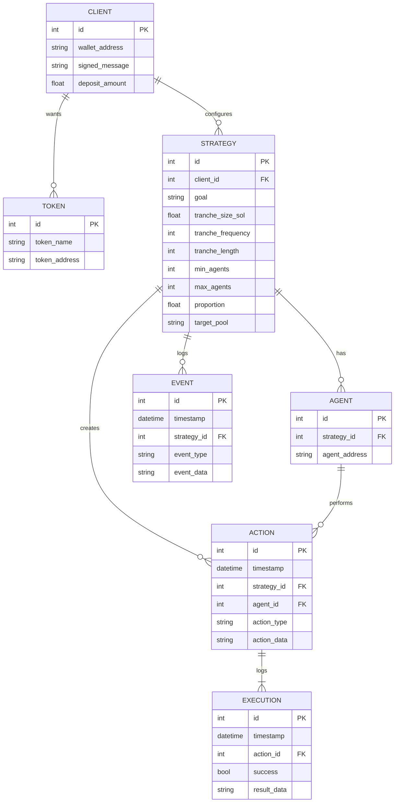

in progress

```mermaid
erDiagram
CLIENT {
int id PK
string wallet_address
string signed_message
float deposit_amount
}

TOKEN {
int id PK
string token_name
string token_address
    }

STRATEGY {
int id PK
int client_id FK
string goal
float tranche_size_sol
int tranche_frequency
int tranche_length
int min_agents
int max_agents
float proportion
string target_pool
}

AGENT {
int id PK
int strategy_id FK
string agent_address
}

EVENT {
int id PK
datetime timestamp
int strategy_id FK
string event_type
string event_data
}

ACTION {
int id PK
datetime timestamp
int strategy_id FK
int agent_id FK
string action_type
string action_data
}

EXECUTION {
int id PK
datetime timestamp
int action_id FK
bool success
string result_data
}

CLIENT ||--o{ STRATEGY : configures
CLIENT ||--o{ TOKEN : wants
STRATEGY ||--o{ AGENT : has
STRATEGY ||--o{ EVENT : logs
STRATEGY ||--o{ ACTION : creates
AGENT ||--o{ ACTION : performs
ACTION ||--|{ EXECUTION : logs


```
